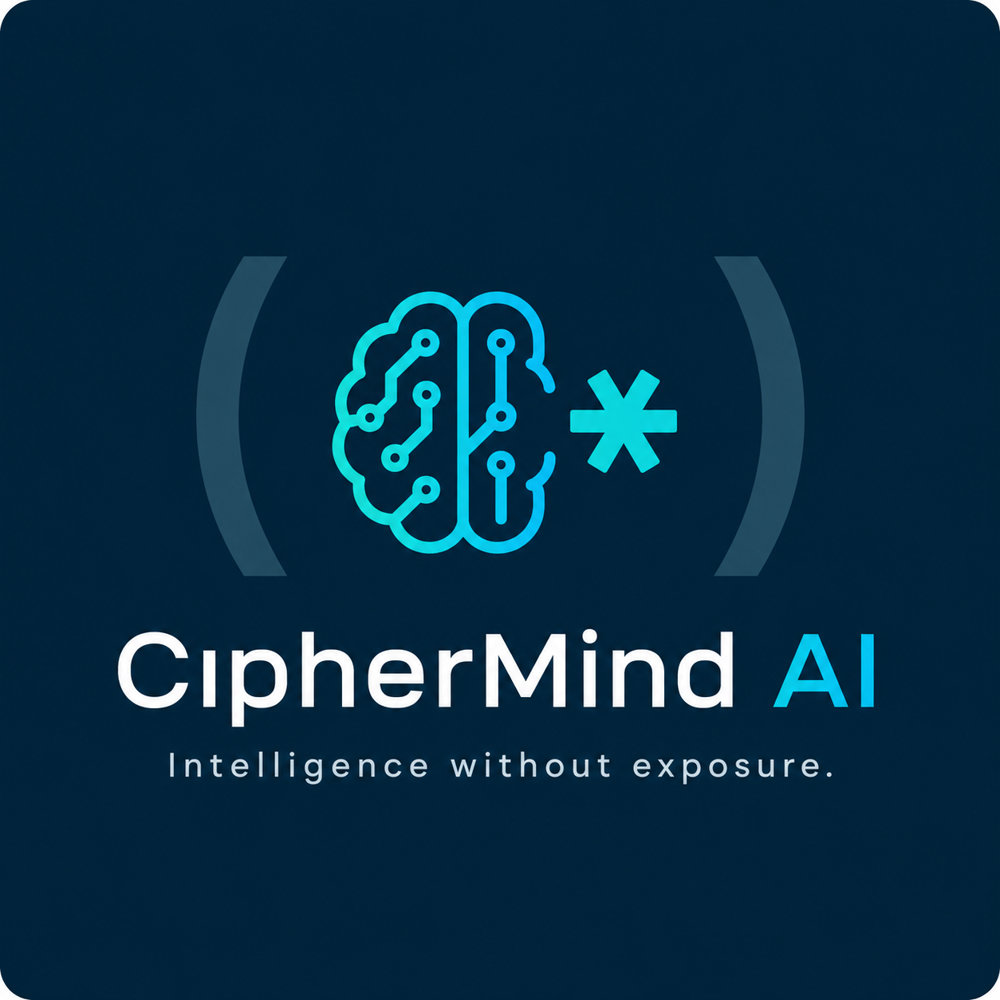

<div align="center">



# CipherMind AI

**Intelligence without exposure.**

A privacy-by-design dApp where autonomous AI agents reason, collaborate, and act on **encrypted** data — and a full confidential-finance suite settles value with the amounts sealed shut. Built on **Fhenix CoFHE** (Fully Homomorphic Encryption) + **Nous Hermes**, live on **Arbitrum Sepolia**.

[](#testing) [](#deployed-contracts-arbitrum-sepolia) [](https://docs.fhenix.io)

</div>

---

## Why privacy-by-design

Public chains default to transparency, and that single architectural choice caps what you can build: institutions with compliance duties, traders protecting strategy, and protocols needing sealed-bid mechanics **can't** operate on transparent rails. FHE removes that ceiling — smart contracts compute directly on ciphertext, so confidentiality is a *primitive*, not a patch bolted on later.

CipherMind treats encryption as foundational. Every sensitive value — a balance, a salary, a vote, a credit profile, a reputation score — is an `euint`/`ebool` on-chain. The product message is the architecture:

> **Autonomous AI agents reason, collaborate, and act on encrypted data without ever exposing the underlying information.**

---

## What it does

CipherMind is one dashboard with two layers, presented as a grid of focused surfaces.

### Confidential-finance layer — on-chain FHE
Mapped to the buildathon's application areas:

| Area | Surface | What stays encrypted |
|------|---------|----------------------|
| **Confidential DeFi** | **Lending** | collateral, debt, health factor — 75% LTV enforced by `FHE.lte`; over-borrow silently draws 0 |
| **Private Payments** | **Payments** vault | balance + transfer amount; overdraft moves 0 via `FHE.select` (no revert, no leak) |
| **Private Payments** | **Payroll** | each employee's salary; per-recipient ACL — the intern never sees the CEO's pay |
| **Private Payments** | **Requests** · **Escrow** | request amount (public memo); 2-of-2 + arbiter escrow over a sealed amount |
| **RWA & Compliance** | **Crowdfund** | encrypted goal & total; public participation, private contributions |
| **Confidential Governance** | **Governance** | individual votes are never stored — only the encrypted tally; result revealed at finalize |
| **RWA & Compliance** | **Reputation** | trust score from encrypted attestations; prove "≥ threshold" without revealing it |
| **Privacy-Preserving AI** | **Credit** · **Trading** | inputs → score/signal via an oracle that decrypts under permit, anonymizes, then re-encrypts |

### Autonomous-AI layer — Hermes on a sealed channel
| Surface | Capability |
|---------|-----------|
| **Agents** | A council of 7 specialized Hermes agents (Research, Trading, Risk, Wallet Security, Governance, Treasury, Sentiment) with a planner → delegate → synthesize orchestrator, **confidence scores**, and a full **reasoning-trace audit log** (verifiable AI). |
| **Automation** | The AI proposes & simulates portfolio actions; a **safety harness** (human-approval mode, spending limits, emergency stop, risk thresholds) gates every execution; approved actions route through the encrypted vault. |
| **Memory** | Persistent agent memory **encrypted at rest** (AES-GCM, key derived from a wallet signature) with keyword recall and memory-aware answers. |
| **Wallet** | On-chain exposure + ERC-20 **approval scanner** with one-click revoke and an AI risk read. |
| **Live** | Realtime chain + market intelligence with a Hermes read of the snapshot. |
| **Market** | Install / save / share agent-workflow templates that run on the council. |
| **Research** | Multi-step, tool-using Hermes research agent. |

**Confidential primitives reused across surfaces:** threshold proofs (prove `≥ X` as an encrypted bool), confidential benchmarking (above-average without revealing scores), and selective disclosure (`FHE.allow` to exactly one viewer).

---

## Architecture

```
┌─ Browser ─────────────┐   ┌─ Arbitrum Sepolia (CoFHE) ─┐   ┌─ Off-chain oracle ─┐   ┌─ Nous ─┐
│ @cofhe/sdk/web         │   │ euint32 / ebool state       │   │ decrypt via permit  │   │ Hermes │
│ encrypt → submit       │──▶│ FHE.add/sub/mul/lt/select   │◀──│ anonymize → infer   │──▶│  4-70B │
│ unseal results         │   │ FHE.allow / allowPublic     │   │ re-encrypt → fulfill│   └────────┘
│ agents · automation    │   └─────────────────────────────┘   └─────────────────────┘
│ memory · live · wallet │
└────────────────────────┘
```

- **Smart contracts** — Solidity `0.8.25`, `@fhenixprotocol/cofhe-contracts`. All sensitive state is encrypted; results are released via per-address `FHE.allow` or `FHE.allowPublic` (governance tallies).
- **Off-chain oracle** — `backend/oracleLogic.ts`, run as a Hardhat task. The only party granted decrypt rights for the AI-scoring surfaces; it anonymizes raw values into bands before the LLM ever sees them.
- **Frontend** — Vite + React 19 + TypeScript. Client-side encryption/unsealing via `@cofhe/sdk/web`; the multi-agent council, autonomous engine, encrypted memory, realtime feed, and wallet analytics all run client-side.
- **AI** — Nous `hermes-4-70b` via the native inference API.

### Monorepo layout
```
contracts/    EncryptedVault, ConfidentialPayroll/Lending/Escrow, PaymentRequests,
              Crowdfund, EncryptedGovernance, ReputationRegistry, CipherMindCredit/Trading, MockUSDC
backend/      oracleLogic.ts · nousClient.ts · researchAgent.ts (credit/trading scorers)
tasks/        deploy-* · oracle · e2e · verify-all
test/         64 tests across all contracts + the oracle loop + the agent loop
frontend/     src/lib (cofhe, contracts, agents, automation, memory, realtime, …) · src/hooks · App.tsx
```

---

## Deployed contracts (Arbitrum Sepolia)

All **11 contracts are verified** on Arbiscan — source is readable and callable directly on the explorer.

| Contract | Address |
|----------|---------|
| EncryptedVault | [`0x1FEE1713517C0d33c01E63D3Af8ed4789a3eA1E6`](https://sepolia.arbiscan.io/address/0x1FEE1713517C0d33c01E63D3Af8ed4789a3eA1E6#code) |
| ConfidentialPayroll | [`0x776B7Bc2086b75ce0603d402C2f1c0655c0A26C7`](https://sepolia.arbiscan.io/address/0x776B7Bc2086b75ce0603d402C2f1c0655c0A26C7#code) |
| ConfidentialLending | [`0x897A2406C9b2FB897bEBb9Bc7c728b303300F1D4`](https://sepolia.arbiscan.io/address/0x897A2406C9b2FB897bEBb9Bc7c728b303300F1D4#code) |
| PaymentRequests | [`0x90C7d251Bcd542Ec01d0ea84A57b634aC3B394dF`](https://sepolia.arbiscan.io/address/0x90C7d251Bcd542Ec01d0ea84A57b634aC3B394dF#code) |
| Crowdfund | [`0x02E6043e09b462C55fb0cf0307be361F9b3BD574`](https://sepolia.arbiscan.io/address/0x02E6043e09b462C55fb0cf0307be361F9b3BD574#code) |
| ConfidentialEscrow | [`0xc7486168DE600EfCdd85c1Fd2fb748cbA8586323`](https://sepolia.arbiscan.io/address/0xc7486168DE600EfCdd85c1Fd2fb748cbA8586323#code) |
| EncryptedGovernance | [`0xd98ca7C68bc571a0504e30579c0B8fBF3C8690dd`](https://sepolia.arbiscan.io/address/0xd98ca7C68bc571a0504e30579c0B8fBF3C8690dd#code) |
| ReputationRegistry | [`0xE51b8D36F2DC2B512680A2045662C8E75BB61a11`](https://sepolia.arbiscan.io/address/0xE51b8D36F2DC2B512680A2045662C8E75BB61a11#code) |
| CipherMindCredit | [`0x1128E66806605bCEf7836147C60a222CDa47cA53`](https://sepolia.arbiscan.io/address/0x1128E66806605bCEf7836147C60a222CDa47cA53#code) |
| CipherMindTrading | [`0x6f281299127c72BF4fF5A4B16408CE615200aD7E`](https://sepolia.arbiscan.io/address/0x6f281299127c72BF4fF5A4B16408CE615200aD7E#code) |
| MockUSDC | [`0xD634Ba983dE5cB66a65eBb113e4aBA36663af75E`](https://sepolia.arbiscan.io/address/0xD634Ba983dE5cB66a65eBb113e4aBA36663af75E#code) |

---

## Tech stack

**Contracts** Solidity 0.8.25 · `@fhenixprotocol/cofhe-contracts` · Hardhat · `@cofhe/hardhat-plugin` · `@cofhe/mock-contracts`
**Client** Vite · React 19 · TypeScript · `@cofhe/sdk/web` · ethers v6 · viem
**AI** Nous Hermes 4 (70B) · custom multi-agent orchestration
**Network** Arbitrum Sepolia (CoFHE coprocessor)

---

## Getting started

### 1. Requirements
- Node.js ≥ 18
- MetaMask on **Arbitrum Sepolia** (the app prompts to add/switch)
- A Nous Research API key — https://portal.nousresearch.com

### 2. Configure environment
Copy `.env.example` → `.env` (repo root) and fill in:
```env
PRIVATE_KEY=your_deployer_oracle_key
NOUS_API_KEY=sk-cn...
NOUS_API_BASE_URL=https://inference-api.nousresearch.com/v1
NOUS_MODEL=nousresearch/hermes-4-70b
ARBISCAN_API_KEY=...           # optional, for contract verification
```
Copy `frontend/.env.example` → `frontend/.env` (contract addresses + `VITE_NOUS_*`).

### 3. Install, test, deploy, run
```bash
npm install
npx hardhat test                                  # 64 passing on CoFHE mocks (no testnet needed)

# deploy (each task prints addresses → paste into .env and frontend/.env)
npx hardhat deploy-vault            --network arb-sepolia
npx hardhat deploy-payroll-lending  --network arb-sepolia
npx hardhat deploy-surfaces         --network arb-sepolia   # Requests, Crowdfund, Escrow
npx hardhat deploy-governance       --network arb-sepolia
npx hardhat deploy-reputation       --network arb-sepolia
npx hardhat deploy-credit           --network arb-sepolia
npx hardhat deploy-trading          --network arb-sepolia
npx hardhat verify-all              --network arb-sepolia   # verify all on Arbiscan

npm run oracle                                    # AI-scoring surfaces; keep running
cd frontend && npm install && npm run dev         # http://localhost:5173
```

> **The real flow:** the browser encrypts inputs with CoFHE and submits ciphertext on-chain. For AI scoring, the oracle — the only party `FHE.allow`'d to read it — decrypts under permit, anonymizes into bands, asks Hermes, then writes an **encrypted** result back. Only you can unseal it. The Payments/Payroll/Lending/Governance/Reputation surfaces are fully on-chain and need no oracle.

---

## Testing

```bash
npx hardhat test                 # full suite (64) on CoFHE mocks
npx hardhat e2e --network arb-sepolia   # live end-to-end: encrypt → oracle → Hermes → unseal
```
Coverage spans every contract (submission, fulfillment, access control, the 3-step decrypt/reveal flow), the real oracle loop, the confidential features (benchmarking, threshold proofs, selective disclosure), and the multi-agent control loop.

---

## Built across the buildathon

CipherMind grew wave over wave — a confidential-finance core, then deeper FHE primitives and surfaces, then an autonomous-AI layer (multi-agent council, encrypted memory, safe autonomous actions, realtime intelligence) — all added **additively** without breaking earlier features. Progress, Fhenix-integration depth, and working/tested code were prioritized over demo-day polish.

See [`SUBMISSION.md`](./SUBMISSION.md) for the full surface-by-surface breakdown and demo script.

---

## Security & scope notes

- Testnet only — do not submit real personal or financial secrets.
- The autonomous-AI layer runs on the Nous integration + public RPC + free market data. Push WebSockets / mempool-whale tracking, a hosted vector DB for memory, and full multi-token analytics would need a paid data provider/backend; these are flagged in-app rather than faked.
- Vault `withdraw` (async-decrypt settlement) and a `cUSDC` ERC-7984 token are deferred follow-ups.

---

## Resources
- Fhenix docs — https://docs.fhenix.io · CoFHE docs — https://cofhe-docs.fhenix.zone
- SDK — `@cofhe/sdk` · Nous Research — https://portal.nousresearch.com

<div align="center">
<em>Built for the Privacy-by-Design dApp Buildathon — the encrypted Fhenix ecosystem.</em>
</div>
